# Hi 👋 I'm Devin Gaughan

**Software developer** and founder of **Auraeon Studios** — building interactive visualizations of physical systems: crystal structures, acoustic waves, rhythm and music, as tools, games, and experiments. Everything we make is about making the invisible legible.

- 🏡 From Vancouver, WA · based in Thailand
- 🖥️ [devingaughan.com](https://devingaughan.com) · ✉️ [devin@devingaughan.com](mailto:devin@devingaughan.com)
- 🗣️ English · ไทย · 日本語
- 🔬 Interested in speculative physics, simulation, and hardware/software crossovers

## Featured Projects

### 🔮 Auraeon – Crystal Lattice Simulator
Interactive 3D visualization of crystal unit cells built with React and Three.js.
🔗 <a href="https://devingaughan.com/auraeon/" target="_blank" rel="noreferrer">Live demo</a>

### 🌐 devingaughan.com
Personal portfolio site — project showcase, writing, and experiments. Built with React + Vite.
🔗 <a href="https://devingaughan.com" target="_blank" rel="noreferrer">Live site</a>

## Skills

## GitHub Stats

## Connect

<table>
<tr>
<td></td>
<td></td>
<td></td>
<td></td>
</tr>
</table>